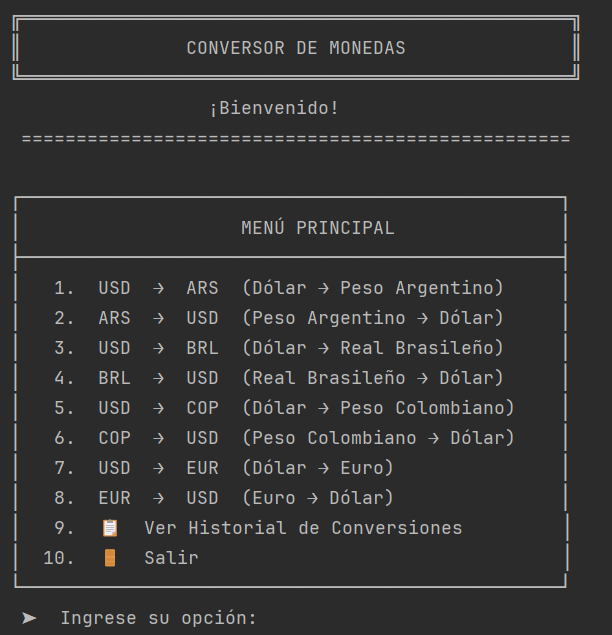
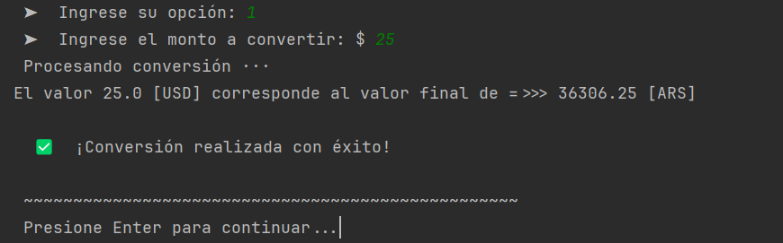
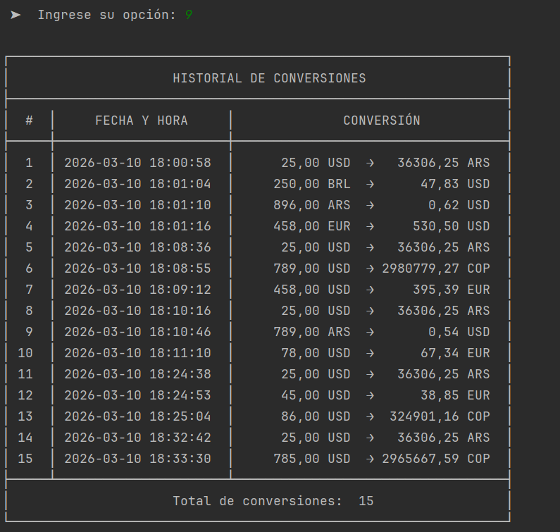

# 💱 Conversor de Monedas en Tiempo Real


Aplicación de consola desarrollada en Java que permite realizar conversiones de moneda en tiempo real utilizando la API de ExchangeRate. El programa mantiene un historial persistente de todas las conversiones realizadas.

## 🚀 Características Principales

- **Conversión en Tiempo Real**: Tasas de cambio actualizadas mediante API externa
- **Múltiples Monedas Soportadas**: USD, ARS, BRL, COP, EUR (fácilmente ampliable)
- **Historial Persistente**: Registro automático de todas las conversiones en formato JSON
- **Interfaz Amigable**: Menú interactivo con diseño elegante en consola
- **Manejo de Errores**: Validación de entradas y gestión de excepciones
- **Formato de Fechas**: Registro timestamp de cada conversión

## 📸 Capturas de Pantalla
### Menú Principal
*Interfaz principal con todas las opciones de conversión*



### Proceso de Conversión
*Ejemplo de conversión de USD a ARS con resultado exitoso*



### Historial de Conversiones
*Visualización del historial con formato de tabla*



## 🛠 Tecnologías Utilizadas

- **Java 17+**: Lenguaje principal de programación
- **Gson 2.13.2**: Biblioteca para serialización/deserialización JSON
- **ExchangeRate-API**: API externa para obtener tasas de cambio actualizadas
- **java.time**: Manejo de fechas y horas (Java 8+)

## ⚙️ Instalación y Configuración

### Prerrequisitos
- JDK 17 o superior
- Maven (opcional, para gestión de dependencias)
- Conexión a Internet (para la API de tasas de cambio)

### Pasos de Instalación

1. **Clonar el repositorio**
   ```bash
   git clone https://github.com/tuusuario/conversor-monedas.git
   cd conversor-monedas


## 📄 Licencia
Distribuido bajo la licencia MIT.
